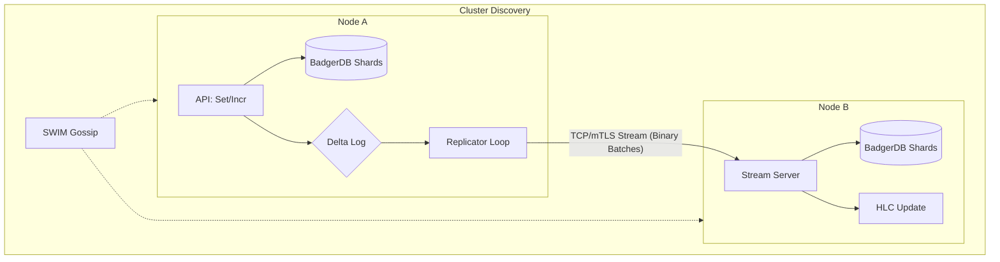
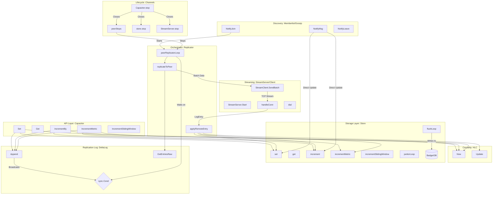

# Capacitor Architecture Guide

Capacitor is a local-first, distributed caching layer designed for high-throughput, low-latency applications. It ensures eventual consistency across a distributed cluster without requiring a central coordinator.

---

## 1. System Conceptual Overview

Below is the high-level architecture showing how data flows from a local write to cluster-wide synchronization:

---

## 2. Detailed Component Architecture

The following diagram outlines the internal sub-systems, interfaces, and function-call flows within a Capacitor node:

---

## 3. Core Component Details

### 3.1 Capacitor (`capacitor.go`)
The root orchestrator that binds all subsystems together:
*   **API Functions**: Exposes thread-safe public APIs (`Set`, `Get`, `GetScan`, `IncrementBy`, etc.) for client interaction.
*   **Replication Loop**: Spawns dynamic background replicators (`startPeerReplicator`) upon discovering new members from gossip events.
*   **Remote Entry Dispatch**: Implements `applyRemoteEntry` to validate, deserialize, and apply incoming sync operations from remote nodes.

### 3.2 Store (`store.go`)
Provides a sharded, thread-safe, memory-backed cache with persistent backing:
*   **256 Shards**: Locks are distributed across 256 independent shards to maximize concurrent read/write throughput and minimize CPU contention.
*   **Persistence (`flushLoop`)**: A background goroutine flushes modified/dirty in-memory keys to BadgerDB every 100ms in batches.
*   **Janitor (`janitorLoop`)**: Periodically purges outdated metadata and sliding window event entries.

### 3.3 DeltaLog (`log.go`)
An in-memory circular byte buffer that maintains recent operations for asynchronous replication:
*   **Fast Appends**: Entries are serialized and written sequentially into pre-allocated memory.
*   **Conditional Synchronization**: Uses `sync.Cond` to wake up dormant replicator loops immediately when a new local write occurs.
*   **Zero-Allocation Batches**: The replicator uses `GetEntriesRaw` to slice and bundle entries without copying or re-serializing them.

### 3.4 Hybrid Logical Clock (`hlc.go`)
Provides causality-preserving timestamps to determine the order of distributed events without requiring synchronized physical NTP clocks:
*   **Now/Update**: Tracks physical and logical counters to enforce monotonic, causality-preserving ordering.
*   **Clock Smash Protection**: Safely discards messages with timestamps in the future exceeding `500ms` compared to the local wall clock, shielding nodes from incorrect peer times.

### 3.5 Stream Server & Client (`transport.go`)
A high-performance streaming layer built over TCP:
*   **mTLS Encryption**: Supports mutual TLS (mTLS) for secure cluster-wide replication.
*   **Gossip Security**: Node registration and initial connections use SHA-256 derived secrets based on the cluster `AuthToken`.
*   **Resource Pooling**: Employs buffer and connection pooling (`sync.Pool`) to avoid garbage collection overhead during peak network replication.

### 3.6 Network (`capacitor.go`)
Integrates with `hashicorp/memberlist` to handle cluster membership, health check gossiping (SWIM protocol), and lightweight state sync.

---

## 4. Data Structures

### LogEntry
The atomic unit of replication representing a state mutation.
*   `Seq`: Monotonic sequence ID.
*   `TS`: HLC Timestamp.
*   `Op`: Operation type (`Set`, `Incr`, `Metric`, `Window`).
*   `Key`, `Value`, `Delta`: Mutated payload.

### Batch
The bundle of replication updates sent over the network.
*   `FromNode`: Identity of the source node.
*   `Entries`: Slice of marshaled `LogEntry` records.
*   `Handshake`: Optional handshake metadata containing the authentication token and last-seen sequence number.

---

## 5. Main Data Paths

### 5.1 Write Path
1.  **Client Invoke**: The client calls `Set(...)` or `Increment(...)`.
2.  **HLC Tick**: The node's internal HLC generates a timestamp.
3.  **Local Store Mutate**: The record is merged in-memory into the appropriate shard.
4.  **Log Append**: The mutation is written to the `DeltaLog`.
5.  **Signal Replicators**: The log appends broadcast to the `sync.Cond` conditional variable.
6.  **Flusher**: The background `flushLoop` grabs the write and flushes it to BadgerDB.

### 5.2 Synchronize / Replication Path
1.  **Replicator Wakeup**: The `peerReplicatorLoop` wakes up on the `sync.Cond` signal.
2.  **Fetch Batch**: Calls `GetEntriesRaw` to fetch un-sent entries starting from the peer's last known sequence.
3.  **TCP Stream**: Packages the batch (including a `Handshake` on first connection) and streams it over mTLS using the `StreamClient`.
4.  **Remote Stream Server**: The remote node's `StreamServer` receives the packet and validates the `AuthToken`.
5.  **Verify & Merge**: The receiving node ticks its local HLC (`hlc.Update()`), compares logical clocks to enforce LWW, updates the local sharded cache, and saves the last replicated sequence.
